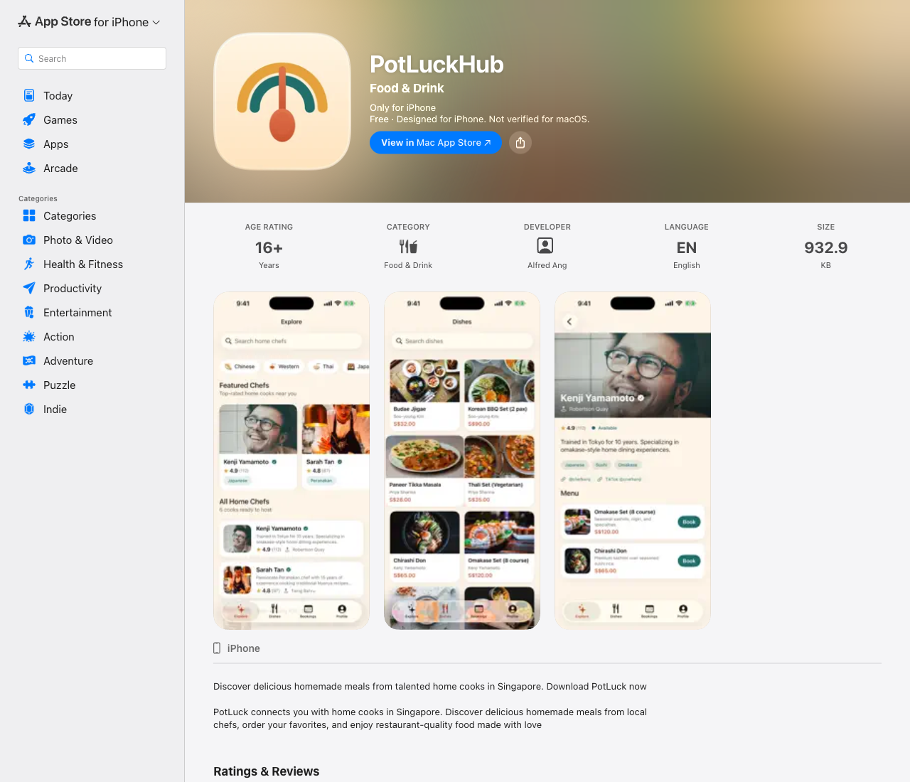
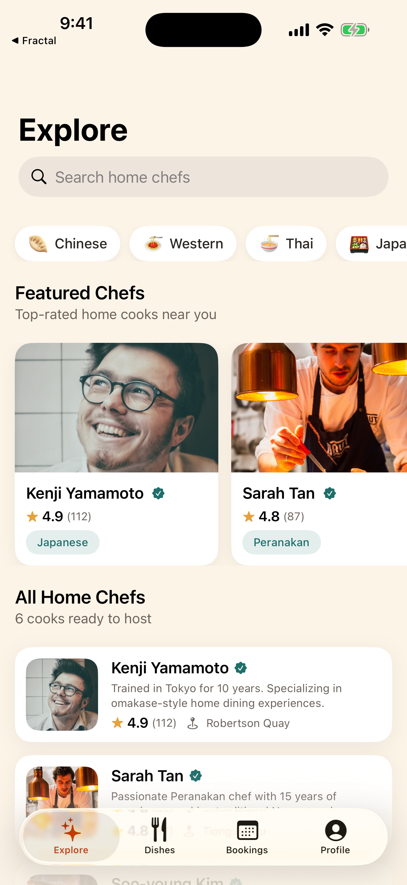
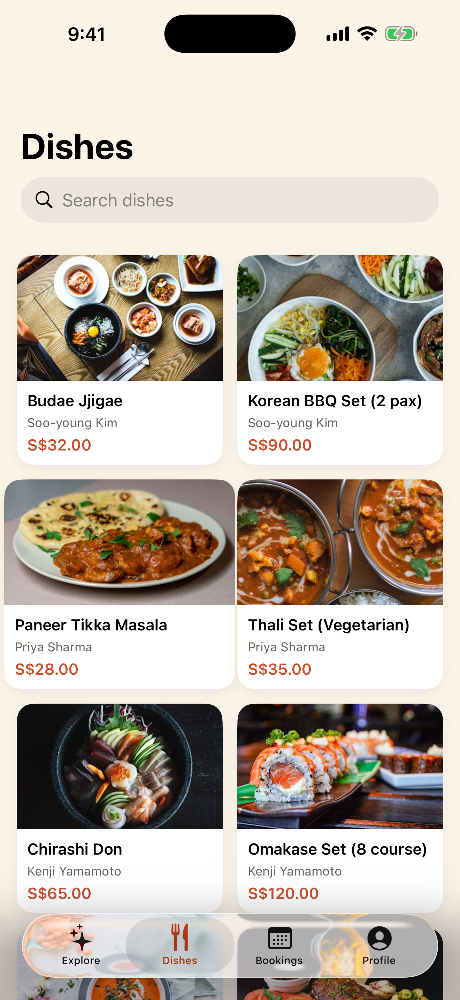
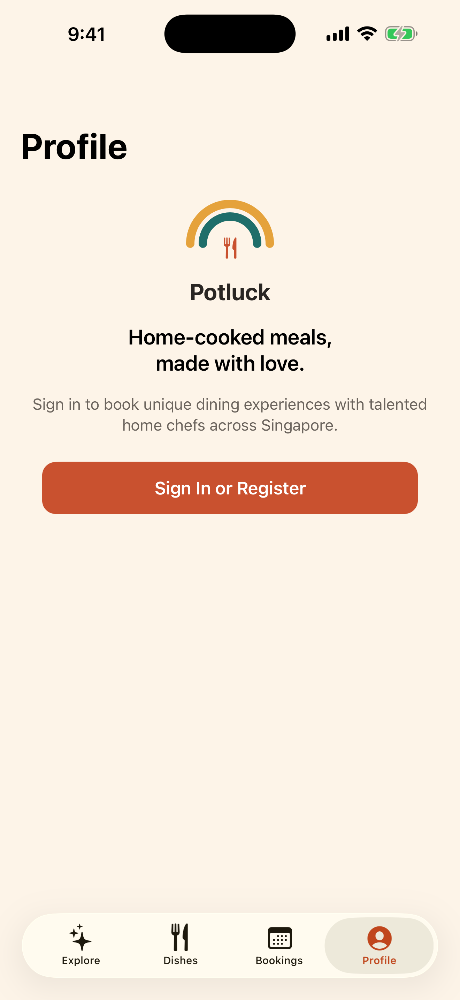

# Potluck — Native iOS App 🌈🥄

[](https://swift.org)
[](https://developer.apple.com/xcode/swiftui/)
[](https://developer.apple.com/xcode/)
[](https://www.apple.com/iphone/)
[](https://apps.apple.com/app/id6759842391)

The native **SwiftUI** iPhone app for [**Potluck**](https://potluckhub.io/) — the Singapore
**home-cook marketplace** at [potluckhub.io](https://potluckhub.io/) connecting home chefs with
food lovers. Discover talented local cooks, browse their menus, and book authentic
home-cooked dining experiences.

### 📲 [Download on the App Store](https://apps.apple.com/app/id6759842391)

> Companion to the [Potluck web platform](https://github.com/alfredang/potluck) — the home-cook
> marketplace site [potluckhub.io](https://potluckhub.io/). This app talks directly to the
> production Potluck API (`api.potluckhub.io`) — no mock data.

## On the App Store

[](https://apps.apple.com/app/id6759842391)

## Screenshots

| Explore | Dishes | Chef Profile | Sign In |
|:---:|:---:|:---:|:---:|
|  |  |  |  |

## Features

- **Explore home chefs** — featured carousel, full directory, search, and nine cuisine filters (Chinese, Western, Thai, Japanese, Korean, Malay, Indian, Halal, Vegetarian)
- **Browse dishes** — a photo-rich grid of menus across every chef, with prices and ratings
- **Verified & Featured chefs** — trust badges backed by Potluck's in-person site-visit verification ([how it works](https://potluckhub.io/chef-verification)), with featured chefs highlighted
- **Chef profiles** — bio, specialties, social links, full menu, and live guest reviews
- **Write reviews & share** — rate a chef (1-5 stars), write a review, and share chefs & dishes via the system share sheet
- **Booking & online payment** — pick a date and guest count, then pay in-app by credit/debit card (Stripe), PayPal, or PayNow (HitPay) through a secure hosted checkout with live order-status polling
- **Accounts** — register / sign in against the live API, with tokens stored securely in the Keychain
- **My bookings** — track requested and confirmed dining experiences

## Tech Stack

| Area | Choice |
|------|--------|
| UI | SwiftUI (iOS 17+), `NavigationStack`, `TabView` |
| Networking | `async`/`await` `URLSession`, `Codable`, typed `APIError` |
| Auth | JWT access/refresh tokens persisted in the **Keychain** |
| State | `ObservableObject` view models per screen |
| Project gen | [XcodeGen](https://github.com/yonaskolb/XcodeGen) (`project.yml`) |
| Backend | Potluck REST API — `https://api.potluckhub.io/api/v1` (catalog/auth) + `https://potluckhub.io/api` (checkout & reviews, shared with the website and Android app) |

## Architecture

```
Potluck/
├── App/            # @main entry, Theme (brand palette), RootView (tabs)
├── Networking/     # APIClient, PotluckService, CheckoutService, ReviewsService, Models
├── Auth/           # AuthManager (session) + Keychain wrapper
├── Components/     # Reusable views (RemoteImage, RatingLabel, Pill, states…)
└── Features/
    ├── Explore/    # Chef discovery + chef detail
    ├── Dishes/     # Menu grid + dish detail
    ├── Booking/    # Booking + payment sheet (Stripe / PayPal / HitPay)
    ├── Reviews/    # Write-a-review sheet
    ├── Bookings/   # My bookings
    └── Profile/    # Auth sheet + profile
```

The API wraps every response in a `{ success, data, pagination? }` envelope; `APIClient`
unwraps it generically. Prices are stored as integer **cents** and ratings sometimes arrive
as strings and sometimes as numbers — a `FlexNumber` decoder handles both.

## Getting Started

Requires **Xcode 16+** and [XcodeGen](https://github.com/yonaskolb/XcodeGen) (`brew install xcodegen`).

```bash
# Generate the Xcode project from project.yml
xcodegen generate

# Open and run
open Potluck.xcodeproj
```

The app points at the production API out of the box, so chefs and dishes load immediately.

## Build & Distribution

```bash
# Archive
xcodebuild archive -project Potluck.xcodeproj -scheme Potluck \
  -configuration Release -destination 'generic/platform=iOS' \
  -archivePath build/Potluck.xcarchive

# Export a signed App Store IPA
xcodebuild -exportArchive -archivePath build/Potluck.xcarchive \
  -exportOptionsPlist ExportOptions.plist -exportPath build/export

# Upload to App Store Connect
xcrun altool --upload-app -f build/export/Potluck.ipa -t ios \
  --apiKey <KEY_ID> --apiIssuer <ISSUER_ID>
```

- **Bundle ID:** `io.potluckhub.app`
- **Version:** 1.3 (build 20260703)

## License

MIT
